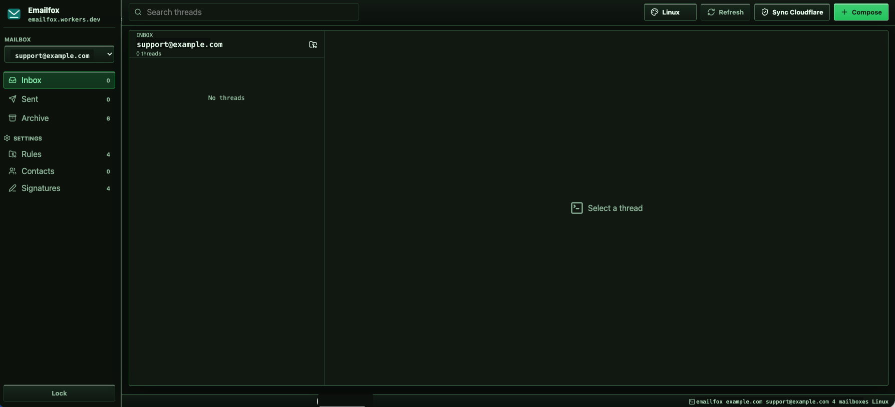
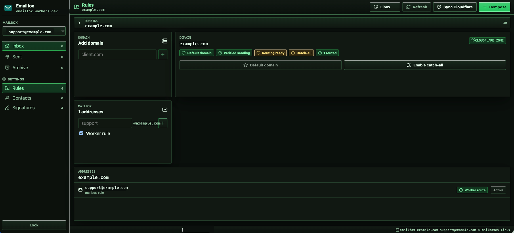

# EmailFox

Emailfox is a private, multi-domain email management panel for Cloudflare Workers, Cloudflare Email Sending, Cloudflare Email Routing, D1, and R2.

It gives you a compact Linux-style webmail/support inbox for domains in your own Cloudflare account:

- Receive routed email in a Cloudflare Worker `email()` handler
- Store thread metadata in D1
- Store raw MIME messages and attachments in R2
- Send replies through Cloudflare Email Sending
- Sync Cloudflare zones, Email Sending status, and Email Routing status
- Create mailbox addresses and Worker routing rules from the UI
- Import contacts manually or from CSV/TXT/VCF files into D1
- Manage mailbox-specific signatures
- Send outbound attachments while storing copies in R2
- Choose between five UI palettes: Linux, Ubuntu, Fedora, Plasma, Graphite

Emailfox is not an IMAP/POP3 server and does not replace a full mailbox provider. It is best for private support inboxes, project inboxes, catch-all workflows, and lightweight multi-domain email operations that already live on Cloudflare.

## Screenshots

The default Linux palette is compact and terminal-like, with mailbox selection, inbox/sent/archive folders, Cloudflare sync, and compose controls on one screen.



Domain routing, catch-all, mailbox rules, contacts, and signatures live under Settings so the inbox stays focused.



## Fork-First Deploy

Do not deploy Emailfox directly from the upstream repository. Fork it first, then deploy your own fork. That gives you a repository you control and makes future updates safer.

Recommended install flow:

1. Click `Fork` on GitHub and create your own copy of this repository.
2. Open Cloudflare Workers & Pages.
3. Create a Worker from Git and select your fork.
4. Deploy the Worker.
5. Open the Worker URL.
6. If Emailfox shows missing Cloudflare setup, add the listed bindings and secrets in the Worker settings, then retry.
7. Finish Emailfox setup inside the app.

The first deploy should not fail because a public template has no personal D1 database id, R2 bucket id, domain, or API token. Add runtime settings after deploy in Cloudflare.

If Cloudflare's Git import screen skips D1/R2 resource setup, Emailfox will still deploy and show the missing binding names on the Worker URL.

## Updating an Existing Install

For updates, use your fork. Pull or merge Emailfox upstream updates into that fork, keep your Worker bindings and secrets in Cloudflare, then let Workers Builds run `npm run deploy`.

The deploy script does not create databases or require account-specific ids:

```bash
npm run build && node tools/deploy-preserving-bindings.mjs
```

Wrangler treats its config file as the source of truth. A plain `wrangler deploy` can remove dashboard-added D1/R2 bindings if they are not present in the deploy config. Emailfox deploys through `tools/deploy-preserving-bindings.mjs`, which reads the existing Worker bindings and writes a temporary deploy config so `DB` and `MAIL_BUCKET` are not disconnected on updates. If it cannot read the existing bindings, it deploys in strict mode to avoid silently removing them.

## 0. Prepare Cloudflare First

Before deploying Emailfox, prepare these items.

### Cloudflare Account

You need a Cloudflare account with Workers enabled and at least one domain managed by Cloudflare if you want production email routing.

### Domain

Add your domain to Cloudflare and make sure the zone is active.

Examples:

- `example.com`
- `company.com`
- `support.example.com`

### Email Sending

Enable Cloudflare Email Sending for every domain or subdomain you want to send from.

Emailfox can only send from a domain marked as verified by Cloudflare and synced into D1.

### Email Routing

Enable Cloudflare Email Routing for every receiving domain.

For inbound mail, you will later choose one of these routing modes in Emailfox:

- Mailbox rule: route one address such as `support@example.com` to the Worker.
- Catch-all: route all unmatched addresses for the domain to the Worker.

Mailbox rules are safer for most setups. Catch-all is powerful, but it also receives misspelled and unknown addresses.

### First Admin Account

After the first deploy, add the required runtime values: `ADMIN_PASSWORD` as a secret, `PRIMARY_DOMAIN` as a plaintext variable, and `CLOUDFLARE_API_TOKEN` as a secret. If no admin account exists, Emailfox shows the setup screen and asks for:

- Name
- Email
- Recovery email, required and outside the primary domain
- Primary domain

The recovery email is the password reset recipient. Use an external address such as a Gmail, iCloud, Outlook, or company mailbox that is not under the primary Emailfox domain.

The first password is read from the `ADMIN_PASSWORD` Worker secret and then stored as a salted PBKDF2 hash in D1.

### Cloudflare Automation Token

Emailfox requires `CLOUDFLARE_API_TOKEN` before first setup so it can verify Cloudflare inventory, Email Routing status, Email Sending status, catch-all setup, and mailbox routing rule creation.

Recommended permissions:

- Account > Account > Read
- Account > Email Sending > Read
- Zone > Zone > Read
- Zone > Email Routing > Read
- Zone > Email Routing > Edit
- Account > Workers Scripts > Read

If your token can access exactly one Cloudflare account, Emailfox detects that account automatically. If it can access multiple accounts, add `CLOUDFLARE_ACCOUNT_ID` as a plaintext variable too.

## Cloudflare Variables And Secrets

After the first deploy, open:

`Worker > Settings > Variables and Secrets > Add`

Add Emailfox runtime settings in that Cloudflare screen. Use `Secret` only for sensitive values. Use plaintext variables for non-sensitive routing and display values.

Cloudflare does not create empty rows from the repository. Add one row for each value you need: choose the `Type`, paste the exact value from `Name` into the Cloudflare `Name` field, type your own value into `Value`, then save.

| Type | Name | Value to type | When to add |
| --- | --- | --- | --- |
| Secret | `ADMIN_PASSWORD` | First admin password, at least 12 characters | Required before first setup |
| Plaintext variable | `PRIMARY_DOMAIN` | Your first email domain, for example `example.com` | Required before first setup |
| Secret | `CLOUDFLARE_API_TOKEN` | Cloudflare API token | Required before first setup |
| Plaintext variable | `WORKER_SCRIPT_NAME` | Deployed Worker script name, for example `emailfox` | Add when you want Emailfox to create Email Routing rules |
| Plaintext variable | `MANAGEMENT_HOST` | Custom dashboard hostname, for example `mail.example.com` | Add only for a custom dashboard hostname |
| Plaintext variable | `PASSWORD_RESET_FROM` | Verified reset sender, for example `no-reply@example.com` | Add only for a custom verified reset sender |
| Plaintext variable | `CLOUDFLARE_ACCOUNT_ID` | Cloudflare account id | Add only if one token can access multiple Cloudflare accounts |

`PRIMARY_DOMAIN` is not a secret. It is fine as a plaintext variable. Do not add `ADMIN_PASSWORD` or `CLOUDFLARE_API_TOKEN` as plaintext variables.

D1 and R2 are not secrets. Add them as Cloudflare bindings/resources:

| Binding name | Resource |
| --- | --- |
| `DB` | D1 database |
| `MAIL_BUCKET` | R2 bucket |
| `EMAIL` | Cloudflare Email Sending binding |

Bindings cannot be replaced by Worker secrets. The running Worker must receive `DB` as a D1 binding and `MAIL_BUCKET` as an R2 binding.

For Git deploys, add these build/deploy variables or secrets too. Emailfox uses them only while deploying to generate a temporary Wrangler config with the same bindings, so updates do not disconnect dashboard-managed resources.

| Name | Value to type | When to add |
| --- | --- | --- |
| `EMAILFOX_D1_DATABASE_ID` | Your D1 database id | Strongly recommended before every Git update deploy |
| `EMAILFOX_D1_DATABASE_NAME` | Your D1 database name, for example `emailfox-db` | Optional, defaults to `emailfox-db` |
| `EMAILFOX_R2_BUCKET_NAME` | Your R2 bucket name, for example `emailfox-mail` | Strongly recommended before every Git update deploy |
| `EMAILFOX_ALLOW_UNBOUND_DEPLOY` | `1` | First deploy only, if you intentionally deploy before adding D1/R2 |

If `EMAILFOX_D1_DATABASE_ID` and `EMAILFOX_R2_BUCKET_NAME` are missing, Emailfox tries to read the current Worker bindings from Cloudflare using `CLOUDFLARE_API_TOKEN` and `CLOUDFLARE_ACCOUNT_ID` when those values are available to the build command. If it cannot preserve both `DB` and `MAIL_BUCKET` on an existing Worker, deploy stops before Wrangler can remove dashboard bindings.

The public template does not commit a personal D1 `database_id` or R2 bucket name. If bindings are missing, Emailfox shows these exact names on the Worker URL instead of failing the build.

The deploy script runs:

```bash
npm run build && node tools/deploy-preserving-bindings.mjs
```

`npm run build` still runs `tools/validate-deploy-config.mjs`, but the public template check is warning-only. Missing runtime setup is handled by the app after deploy.

Emailfox performs a defensive schema check during setup and inbound email handling. When the `DB` binding exists, the Worker can complete the current schema on that binding and mark the bundled migrations as applied. It does not create a new D1 database.

For binding-safe deploys, make `CLOUDFLARE_API_TOKEN` available to the build/deploy command too. If the token can access multiple accounts, also set `CLOUDFLARE_ACCOUNT_ID`. Private installs may alternatively set `EMAILFOX_D1_DATABASE_ID` and `EMAILFOX_R2_BUCKET_NAME` as build variables.

If the Cloudflare Git deploy screen asks for commands, use:

- Build command: `npm run build`
- Deploy command: `npm run deploy`

## First Login

After deploy:

1. Open the Worker URL shown by Cloudflare.
2. If Emailfox lists missing setup, add those binding/secret names in Cloudflare Worker settings.
3. Complete the setup screen with name, email, recovery email, and primary domain.
4. Log in with the `ADMIN_PASSWORD` secret value.
5. Create mailboxes such as `support`, `info`, or `billing`.
6. Use `Settings > Rules` to route addresses to the Worker.
7. Click `Sync Cloudflare` to refresh Cloudflare inventory and routing checks.

## Custom Domain

The public template intentionally does not include a personal custom domain in `wrangler.jsonc`.

To use your own management host, add a custom domain in Cloudflare Workers, then set:

```bash
npx wrangler secret put MANAGEMENT_HOST
```

You can also keep `MANAGEMENT_HOST` blank and use the generated `workers.dev` URL.

## Manual Install

Use this path if you deploy from your own machine instead of Cloudflare Git deploy.

Install dependencies:

```bash
npm install
```

Create D1 and R2:

```bash
npx wrangler d1 create emailfox-db
npx wrangler r2 bucket create emailfox-mail
```

For a dashboard-managed install, deploy first and add these bindings in Cloudflare:

- `DB` -> the D1 database
- `MAIL_BUCKET` -> the R2 bucket
- `EMAIL` -> Cloudflare Email Sending

For a private Wrangler-managed install, add your own D1 `database_id` and R2 `bucket_name` to your private fork's `wrangler.jsonc`:

```jsonc
"d1_databases": [
  {
    "binding": "DB",
    "database_name": "emailfox-db",
    "database_id": "your-d1-database-id"
  }
],
"r2_buckets": [
  {
    "binding": "MAIL_BUCKET",
    "bucket_name": "emailfox-mail"
  }
]
```

Build and deploy:

```bash
npm run deploy
```

If your private `wrangler.jsonc` contains the `DB` binding and you want to run migrations explicitly before deploy, use:

```bash
npm run deploy:with-migrations
```

Then set Emailfox runtime settings in Cloudflare:

`Worker > Settings > Variables and Secrets > Add`

Wrangler secret equivalent:

```bash
npx wrangler secret put ADMIN_PASSWORD
npx wrangler secret put CLOUDFLARE_API_TOKEN
```

Set plaintext variables such as `PRIMARY_DOMAIN`, `WORKER_SCRIPT_NAME`, `MANAGEMENT_HOST`, `PASSWORD_RESET_FROM`, and `CLOUDFLARE_ACCOUNT_ID` in the Cloudflare dashboard. For private installs only, you may keep plaintext values under `vars` in your private `wrangler.jsonc`; do not commit personal values to a public fork.

Set `ADMIN_PASSWORD`, `PRIMARY_DOMAIN`, and `CLOUDFLARE_API_TOKEN` before first setup. Only set the optional plaintext variables you need.

## Local Development

Create `.dev.vars` only if you need local-only secret values:

```bash
touch .dev.vars
```

Edit `.dev.vars` only if you want local secrets. Do not commit it.

```dotenv
# optional local secrets go here
# ADMIN_PASSWORD=
# CLOUDFLARE_API_TOKEN=

# optional local plaintext variables go here
# PRIMARY_DOMAIN=
```

Optional local-only values:

```dotenv
PASSWORD_RESET_FROM=no-reply@example.com
```

If you want local sample data, add this only to your local `.dev.vars`:

```dotenv
ENABLE_DEV_SEED=true
```

Run the Worker API:

```bash
npm run dev:worker
```

Run the Vite UI:

```bash
npm run dev
```

Vite proxies `/api` to `http://127.0.0.1:8787`.

For local sample data after migrations:

```bash
curl -X POST http://127.0.0.1:8787/api/dev/seed \
  -H "Authorization: Bearer $EMAILFOX_PASSWORD" \
  -H "Content-Type: application/json" \
  -d "{}"
```

The seed endpoint is disabled unless `ENABLE_DEV_SEED=true`.

## Architecture

| Layer | Technology |
| --- | --- |
| UI | React + Vite |
| Runtime | Cloudflare Workers |
| Static assets | Workers assets binding |
| Inbound email | Cloudflare Email Routing to Worker `email()` handler |
| Outbound email | Cloudflare Email Sending binding |
| Metadata | Cloudflare D1 |
| Raw mail/attachments | Cloudflare R2 |
| Admin auth | D1-stored salted PBKDF2 password hash |

## Security Notes

- Do not commit `.dev.vars`.
- Do not commit real API tokens or admin passwords.
- Use least-privilege Cloudflare API tokens.
- Password reset tokens are stored hashed in D1 and expire after 30 minutes.
- Emailfox only sends from enabled D1 mailbox addresses on verified sending domains.
- `sessionStorage` is used for the admin password in the browser session. For a larger public SaaS deployment, consider replacing this with HttpOnly session cookies and CSRF protection.
- The default public template has no custom domain, account id, D1 id, or personal domain baked into source control.

## Useful Commands

```bash
npm run types
npm run check
npm run build
npm run deploy
npm run db:migrate:local
npm run db:migrate:remote
```

## Public Repository Checklist

Before making your repository public:

- Confirm `wrangler.jsonc` does not contain your personal account id, D1 id, or custom domain.
- Confirm `.dev.vars` is not tracked.
- Confirm docs/screenshots do not show private domains or real emails.
- Confirm the README uses the fork-first install flow and does not include a one-click deploy button.
- Run `npm audit --audit-level=moderate`.
- Run `npm run build`.

## License

Choose and add a license before announcing the repository publicly. MIT is a common choice for small developer tools, but pick the license that matches how you want others to use Emailfox.
