# OmniDock

<p align="center">
  <strong>Self-hosted email operations for Cloudflare Workers, Email Routing, Email Sending, D1, and R2.</strong>
</p>

<p align="center">
  <a href="https://omnidock.org">Website</a>
  ·
  <a href="#quick-start">Quick start</a>
  ·
  <a href="#features">Features</a>
  ·
  <a href="#r2-file-operations">R2 file operations</a>
  ·
  <a href="#external-email-accounts">External email</a>
  ·
  <a href="#security-notes">Security</a>
  ·
  <a href="docs/GITHUB_SEO.md">GitHub SEO checklist</a>
</p>

<p align="center">
  
  
  
  
  
  
</p>

<p align="center">
  
  
  
  
  
</p>

<p align="center">
  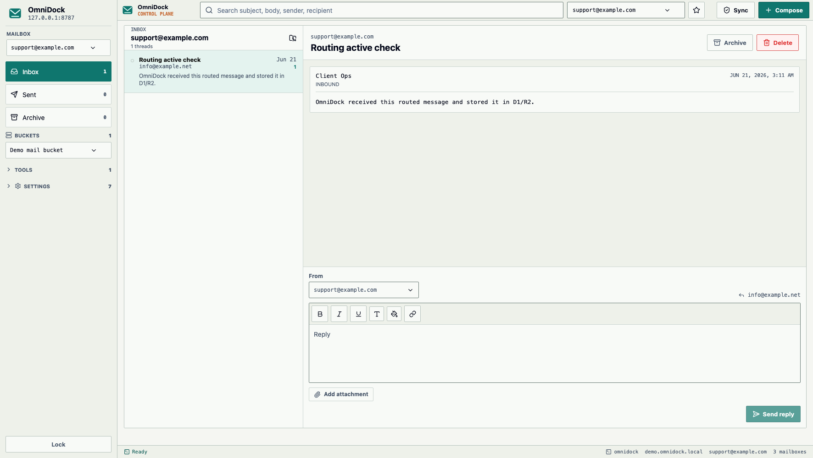
</p>

OmniDock is an open-source Cloudflare email dashboard for teams that want a private support inbox, multi-domain email routing, Cloudflare Email Sending, Cloudflare Email Routing, R2 file management, contacts, signatures, and external inbox sync in one Workers app.

Think of it as a compact Linux-style command center for domain email: not a hosted mailbox provider, not a SaaS lock-in, and not a black box. You fork it, connect your own Cloudflare account, keep your own D1/R2 data, and run the dashboard on your own Worker.

Website: [omnidock.org](https://omnidock.org)

## At A Glance

| Built for | What it unlocks |
| --- | --- |
| Cloudflare email teams | One dashboard for Email Routing, Email Sending, D1 metadata, R2 objects, contacts, signatures, and logs |
| R2-heavy workflows | Browse buckets, create folders, upload/download/delete objects, preview PDFs/images/text, and search indexed object text |
| External inbox operations | Connect Gmail, Outlook, Yahoo, iCloud, or custom IMAP/SMTP profiles without storing real credentials in D1 |
| Public forks | Keep account ids, API tokens, passwords, private bucket names, and personal domains out of source control |

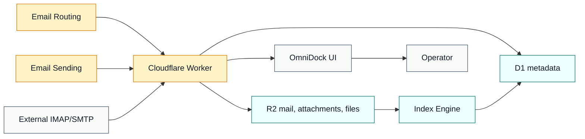

## Why OmniDock

Cloudflare gives developers strong primitives for email and storage, but the operational workflow is split across zones, Email Routing rules, Email Sending checks, D1 tables, R2 buckets, external inboxes, and manual dashboard work. OmniDock brings those pieces into one focused admin UI.

Use OmniDock when you need:

- A self-hosted Cloudflare support inbox for `support@`, `info@`, `billing@`, or project addresses.
- Multi-domain email routing across several Cloudflare zones.
- A private email dashboard for agencies, internal teams, SaaS side projects, or product support.
- Cloudflare Email Routing and Email Sending automation without building your own admin panel.
- R2 attachment storage and a lightweight R2 bucket manager next to email.
- Gmail, Outlook, Yahoo, iCloud, or custom IMAP/SMTP profiles pulled into the same workspace.
- A public, fork-first repository that avoids committing account ids, D1 ids, bucket names, tokens, passwords, or personal domains.

OmniDock is not an IMAP/POP3 server and does not replace a full hosted mailbox provider. It is best for private support inboxes, project inboxes, catch-all workflows, domain operations, and lightweight email management that already lives on Cloudflare.

## Features

| Area | What OmniDock provides |
| --- | --- |
| Inbound email | Cloudflare Worker `email()` handler, Email Routing support, mailbox rules, catch-all routing |
| Outbound email | Cloudflare Email Sending plus external SMTP sending for configured accounts |
| Storage | D1 metadata, R2 raw messages, R2 attachments, R2 manual files, extra R2 buckets |
| Inbox workflow | Inbox, sent, archive, delete, read state, thread view, mailbox scope, global search |
| Compose | Rich text, links, colors, signatures, attachments, attachment loading guards |
| Domains and rules | Cloudflare zone sync, sending/routing status, default domain, mailbox routing rules |
| Contacts | Manual contacts, CSV/TXT/VCF import, phone, company, tags, notes, edit/delete |
| Signatures | Mailbox-based rich signatures with text styling and links |
| External accounts | Gmail and custom IMAP/SMTP profiles with Worker-secret credential references |
| Buckets | Browse R2 folders, preview PDF/image/text files, upload, download, delete, search paths, searchable PDFs, and saved OCR/text indexes |
| Logs | Audit log table for sync, sending, errors, warnings, exports, and cleanup |
| UI | Light Linux/workstation control-plane design with compact desktop layout |

## R2 File Operations

OmniDock treats Cloudflare R2 as more than attachment storage. The Buckets view is a small R2 file manager built into the same email operations workspace.

| R2 capability | Details |
| --- | --- |
| Multi-bucket browsing | `MAIL_BUCKET` plus optional buckets from `OMNIDOCK_EXTRA_R2_BUCKETS`, shown with readable bucket names |
| Folder workflow | Prefix browsing, folder creation, nested folders, parent navigation, and object-level actions |
| File preview | Inline previews for PDFs, images, text files, and supported attachments before download |
| Upload and cleanup | Manual uploads, download actions, object delete flow, audit logs, and public-safe confirmation states |
| Search | Filename/path search, supported text search, extractable PDF search, and saved D1 text indexes |
| Index Engine | Scans configured buckets, skips unchanged objects by ETag and size, and stores searchable text in D1 |
| Workers AI ready | Optional `AI` binding enables Markdown Conversion for supported scanned PDFs, images, Office files, and spreadsheets |

<p align="center">
  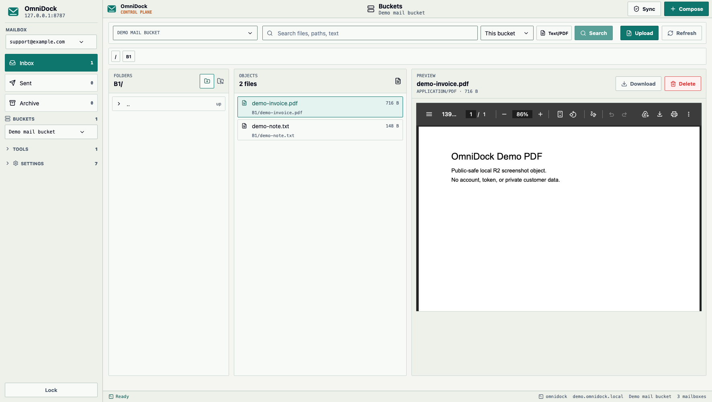
</p>

## External Email Accounts

External accounts let OmniDock pull and send through provider mailboxes while keeping the dashboard self-hosted. Profiles can be inbound-only, outbound-only, or both.

| External email capability | Details |
| --- | --- |
| Provider profiles | Gmail, Outlook, Yahoo, iCloud, and custom IMAP/SMTP settings |
| Secret-safe storage | OmniDock stores provider metadata and the Worker secret name, not the app password or OAuth secret value |
| Resumable sync | D1-backed jobs keep folder and UID cursors, so long inbox pulls continue after refreshes or scheduled runs |
| SMTP sending | Configured external accounts can send outbound mail through their SMTP profile |
| Operator control | Sync state, account status, provider settings, and audit logs live in the same workstation UI |
| Public repo safety | Demo docs use placeholder addresses; real external credentials belong only in Cloudflare Worker secrets |

<p align="center">
  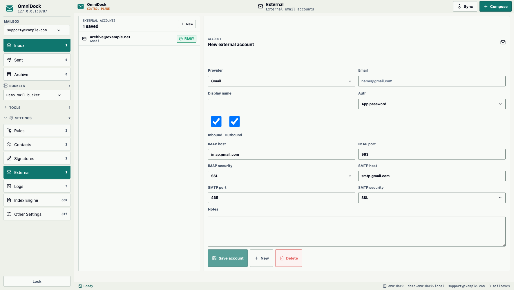
</p>

## What It Does

- Receive inbound mail through a Cloudflare Worker `email()` handler.
- Store message and thread metadata in Cloudflare D1.
- Store raw MIME messages, attachments, and manual files in Cloudflare R2.
- Send replies and outbound messages through Cloudflare Email Sending or configured external SMTP accounts.
- Sync Cloudflare zones, Email Sending status, Email Routing status, catch-all state, mailbox routing rules, and external IMAP inboxes from one button.
- Continue long external inbox pulls in D1-backed jobs so page refresh does not cancel the sync.
- Manage multiple domains and mailbox addresses from one dashboard.
- Route one mailbox address or all unmatched domain mail with catch-all.
- Search inbox, sent, and archive across subject, body, sender, and recipient.
- Search R2 object paths, supported text files, searchable PDFs, and saved text indexes.
- Archive, unarchive, and delete threads.
- Compose rich email with bold, italic, underline, text color, background color, links, signatures, and attachments.
- Preview PDF, image, text, and supported attachment files before download.
- Import contacts manually or from CSV, TXT, and VCF files; edit contacts one by one; store phone, company, tags, and notes.
- Manage mailbox-specific rich signatures with text style and links.
- Add external account profiles for Gmail, Outlook, Yahoo, iCloud, or custom IMAP/SMTP settings. OmniDock stores the Worker secret name, not the credential value.
- Browse one or more configured R2 buckets from the sidebar, create folders, preview PDF/image/text objects, upload files with progress, download files, delete files, and run a D1-backed Index Engine for searchable text and OCR-style document extraction.
- Review app activity in Logs, export logs, and delete logs from D1.
- Use a single light Linux/workstation management interface with sharp borders, compact typography, and high-contrast controls.
- Set a default mailbox and customize automatic refresh timing.

## Screenshots

These screenshots are captured from a real local OmniDock Worker with public-safe demo data. They cover every primary module area in the app.

| Mail | R2 buckets |
| --- | --- |
|  |  |

| Rules | Contacts |
| --- | --- |
| 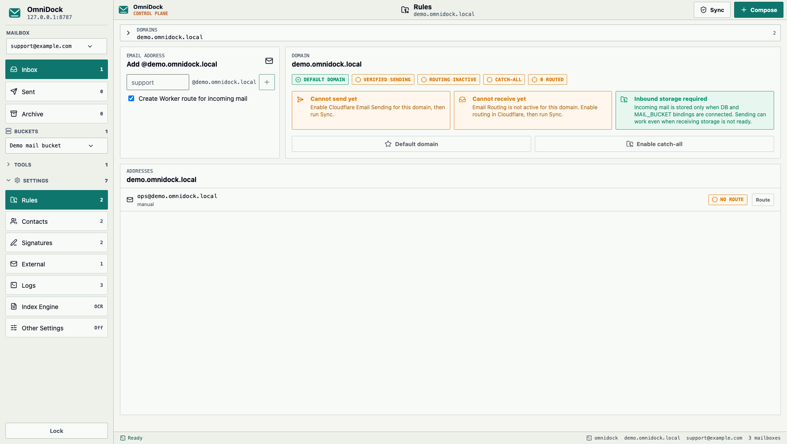 | 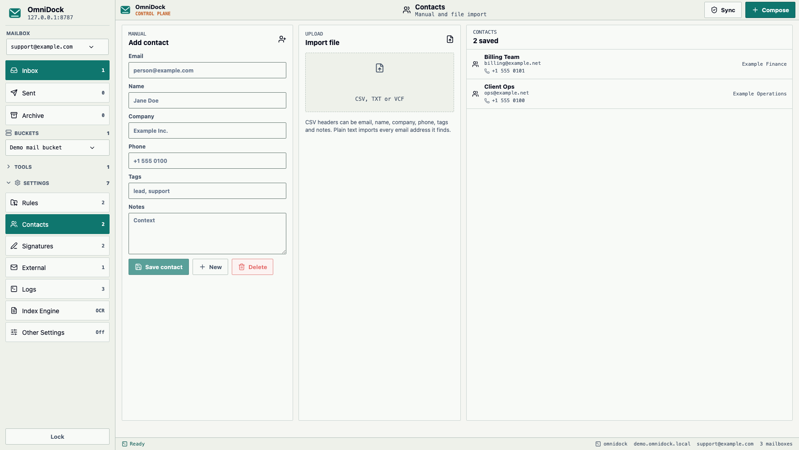 |

| Signatures | External accounts |
| --- | --- |
| 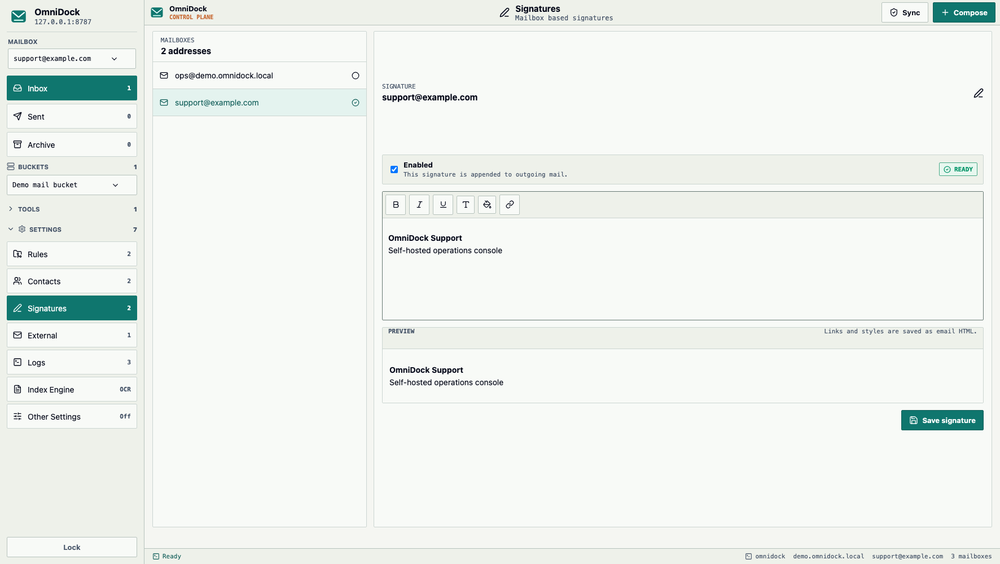 |  |

| Logs | Index Engine |
| --- | --- |
| 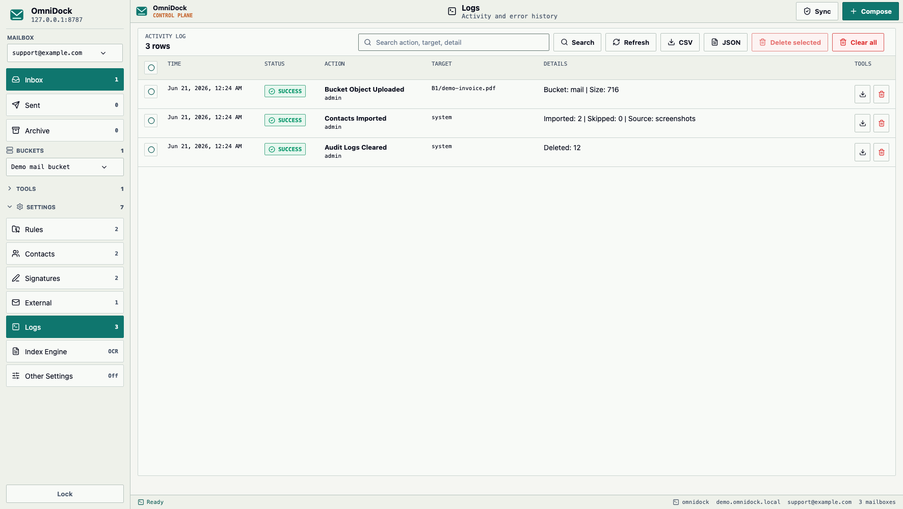 | 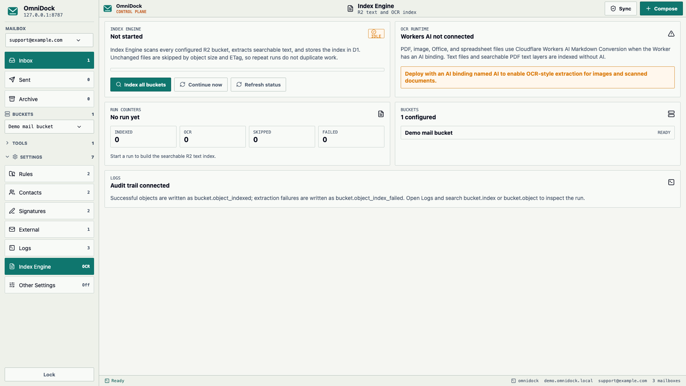 |

| Notes | Other settings |
| --- | --- |
| 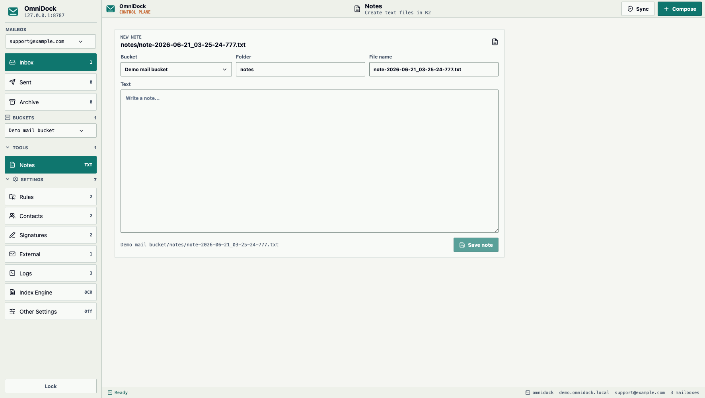 | 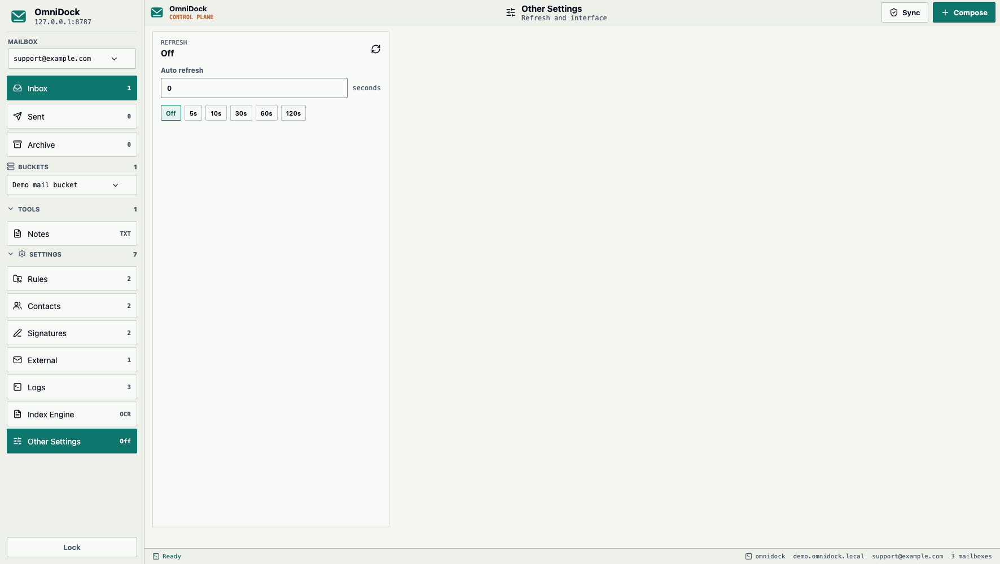 |

## Quick Start

Short version for a clean Cloudflare Git deployment:

1. Fork this repository.
2. Create one Cloudflare D1 database and one Cloudflare R2 bucket.
3. Create a Worker from Git and select your fork.
4. Set the build command to `npm run build`.
5. Set the deploy command to `node tools/deploy-preserving-bindings.mjs`.
6. Add build variables for `OMNIDOCK_D1_DATABASE_ID` and `OMNIDOCK_R2_BUCKET_NAME`.
7. Add runtime values for `ADMIN_PASSWORD`, `PRIMARY_DOMAIN`, and `CLOUDFLARE_API_TOKEN`.
8. Open the Worker URL, finish setup, run Sync, and create mailbox rules.

The fork-first flow is intentional. It keeps your install private, keeps your Cloudflare resource ids out of upstream source control, and prevents Git updates from breaking D1/R2 bindings.

## Why Fork First

Do not deploy OmniDock directly from the upstream repository. Fork it first, then deploy your own fork.

That gives you:

- A repository you control.
- A clean place to keep your own deployment settings.
- Safer future updates.
- No one-click deploy magic that hides Cloudflare bindings from you.

Recommended install flow:

1. Fork this repository.
2. Open Cloudflare Workers & Pages.
3. Create a D1 database and an R2 bucket.
4. Create a Worker from Git and select your fork.
5. Add the build variables listed below in `Settings > Build > Build configuration`.
6. Set the deploy command to the binding-safe command listed below.
7. Add runtime variables and secrets in Worker settings.
8. Open the Worker URL and finish setup inside OmniDock.

## Critical Binding Rule

Cloudflare Wrangler treats the deploy config as the source of truth. If you add D1 or R2 only in the dashboard and then deploy from Git with a config that does not contain those bindings, Wrangler can remove them.

OmniDock avoids that by generating `DB` and `MAIL_BUCKET` into the deploy config from build variables:

- `OMNIDOCK_D1_DATABASE_ID`
- `OMNIDOCK_R2_BUCKET_NAME`
- `OMNIDOCK_EXTRA_R2_BUCKETS` for any additional R2 bucket names

The default Worker script name is `omnidock`. If your deployed Worker uses a different script name, add `WORKER_SCRIPT_NAME` as a build variable with that exact name before deploying.

Use these Cloudflare Workers Builds commands:

| Cloudflare field | Recommended value |
| --- | --- |
| Build command | `npm run build` |
| Deploy command | `node tools/deploy-preserving-bindings.mjs` |

Alternative: leave Build command empty and set Deploy command to:

```bash
npm run deploy
```

Do not use a bare deploy command of `npx wrangler deploy` for normal Git updates.
That command cannot safely reconstruct dashboard-only resource bindings. Use the OmniDock deploy script so existing D1/R2 bindings are read, merged, and carried forward.

## 0. Prepare Cloudflare

Before deploying, prepare these items.

### Cloudflare Account

You need a Cloudflare account with Workers enabled. Production email routing also requires at least one active Cloudflare-managed domain.

### Domain

Add your email domain to Cloudflare and make sure the zone is active.

Examples:

- `example.com`
- `company.com`
- `support.example.com`

### Email Sending

Enable Cloudflare Email Sending for every domain or subdomain you want to send from.

OmniDock can send only from mailbox addresses that exist in D1 and belong to a Cloudflare-verified sending domain.

### Email Routing

Enable Cloudflare Email Routing for every domain that should receive mail.

In OmniDock you can choose one of two routing styles:

- Mailbox rule: route a single address such as `support@example.com` to the Worker.
- Catch-all: route all unmatched addresses for the domain to the Worker.

Mailbox rules are safer for most setups. Catch-all is powerful, but it also receives misspelled and unknown addresses.

### D1 And R2

Create:

- One D1 database for metadata.
- One R2 bucket for raw messages, attachments, and manual files.

Suggested names:

```bash
omnidock-db
omnidock-mail
```

The actual D1 `database_id` and R2 bucket name must be added as build variables so updates do not disconnect bindings.

### Cloudflare Automation Token

OmniDock requires `CLOUDFLARE_API_TOKEN` before first setup. The token is used to verify Cloudflare inventory and automate Email Routing checks, Email Sending checks, catch-all setup, and mailbox routing rule creation.

Recommended permissions:

- Account > Account > Read
- Account > Email Sending > Read
- Zone > Zone > Read
- Zone > Email Routing > Read
- Zone > Email Routing > Edit
- Account > Workers Scripts > Read

If the token can access exactly one Cloudflare account, OmniDock detects that account automatically. If it can access multiple accounts, also add `CLOUDFLARE_ACCOUNT_ID`.

## Cloudflare Build Variables

Add these under:

`Worker > Settings > Build > Build configuration > Variables and secrets`

These values are build-time values. They are used to deploy the Worker with correct D1/R2 bindings. They are not app runtime secrets.

| Name | Value to type | Required |
| --- | --- | --- |
| `OMNIDOCK_D1_DATABASE_ID` | Your D1 database id | Yes |
| `OMNIDOCK_R2_BUCKET_NAME` | Your R2 bucket name, for example `omnidock-mail` | Yes |
| `OMNIDOCK_D1_DATABASE_NAME` | D1 display name, for example `omnidock-db` | Optional |
| `OMNIDOCK_EXTRA_R2_BUCKETS` | Extra R2 bucket names, for example `client-files,media-files` | Optional |
| `WORKER_SCRIPT_NAME` | Deployed Worker script name, for example `omnidock` | Optional, only when your script name is different |
| `CLOUDFLARE_ACCOUNT_ID` | Cloudflare account id | Only if the build token can access multiple accounts |

If these values are missing during a Git update, OmniDock may stop the deploy to protect existing `DB` and `MAIL_BUCKET` bindings from being removed. Extra R2 buckets are preserved when they already exist in your private `wrangler.jsonc`, are listed in `OMNIDOCK_EXTRA_R2_BUCKETS`, or can be read from Cloudflare by `node tools/deploy-preserving-bindings.mjs`.

## Runtime Variables And Secrets

After deploy, open:

`Worker > Settings > Variables and Secrets > Add`

Use `Secret` only for sensitive values. Use plaintext variables for non-sensitive routing and display values.

Cloudflare does not create empty variable rows from the repository. Add one row for each value you need: choose `Type`, paste the exact `Name`, type your own `Value`, then save.

| Type | Name | Value to type | When to add |
| --- | --- | --- | --- |
| Secret | `ADMIN_PASSWORD` | First admin password, at least 12 characters | Required before first setup |
| Plaintext variable | `PRIMARY_DOMAIN` | First managed email domain, for example `example.com` | Required before first setup |
| Secret | `CLOUDFLARE_API_TOKEN` | Cloudflare API token | Required before first setup |
| Plaintext variable | `WORKER_SCRIPT_NAME` | Deployed Worker script name, for example `omnidock` | Add when OmniDock should create Email Routing rules |
| Plaintext variable | `MANAGEMENT_HOST` | Custom dashboard hostname, for example `mail.example.com` | Optional |
| Plaintext variable | `PASSWORD_RESET_FROM` | Verified reset sender, for example `no-reply@example.com` | Optional |
| Plaintext variable | `CLOUDFLARE_ACCOUNT_ID` | Cloudflare account id | Only if one token can access multiple accounts |

`PRIMARY_DOMAIN`, `WORKER_SCRIPT_NAME`, `MANAGEMENT_HOST`, `PASSWORD_RESET_FROM`, and `CLOUDFLARE_ACCOUNT_ID` are not secrets.

Do not add `ADMIN_PASSWORD` or `CLOUDFLARE_API_TOKEN` as plaintext variables.

## Required Bindings

D1, R2, Email Sending, and Workers AI are bindings, not secrets.

| Binding name | Resource |
| --- | --- |
| `DB` | Cloudflare D1 database |
| `MAIL_BUCKET` | Cloudflare R2 bucket |
| `EMAIL` | Cloudflare Email Sending binding |
| `AI` | Workers AI binding for Index Engine document-to-markdown and OCR-style extraction |

The running Worker must receive `DB` as a D1 binding and `MAIL_BUCKET` as an R2 binding. The `AI` binding is included in the public config so Index Engine can use Cloudflare Workers AI Markdown Conversion for supported PDFs, images, Office files, and spreadsheets. R2 bucket names are copied into runtime display variables during deploy so the Buckets UI can show real bucket names instead of binding names.

### Extra R2 Buckets

`MAIL_BUCKET` is the primary bucket used for raw email, attachments, and manual files. You can attach additional R2 buckets for file browsing and management.

Simple path for extra buckets:

1. Create or select the R2 buckets in Cloudflare.
2. Add one build variable named `OMNIDOCK_EXTRA_R2_BUCKETS`.
3. Put only the bucket names in the value, separated by commas.
4. Deploy with `node tools/deploy-preserving-bindings.mjs` or `npm run deploy`.

```dotenv
OMNIDOCK_EXTRA_R2_BUCKETS=client-files,media-files
```

OmniDock automatically creates safe Worker binding names such as `R2_CLIENT_FILES` and `R2_MEDIA_FILES`, then shows the real bucket names in the Buckets dropdown.

Do not open the Worker R2 binding form for this simple path. If Cloudflare asks you to choose an R2 bucket from a dropdown, you are in the manual Bindings screen. Cancel that form and add `OMNIDOCK_EXTRA_R2_BUCKETS` under Build configuration > Variables and secrets instead.

Advanced custom binding names are still supported when you need them:

```dotenv
OMNIDOCK_EXTRA_R2_BUCKETS=FILES_BUCKET:client-files,MEDIA_BUCKET:media-files
```

Keep the Cloudflare deploy command as `node tools/deploy-preserving-bindings.mjs` or `npm run deploy`. A bare `npx wrangler deploy` can remove extra R2 bindings that only exist in the dashboard.

## First Login

After deploy:

1. Open the Worker URL shown by Cloudflare.
2. If OmniDock lists missing setup, add the listed bindings, variables, or secrets in Cloudflare Worker settings.
3. Complete the setup screen with name, email, recovery email, primary domain, and admin password.
4. The admin password must match the `ADMIN_PASSWORD` secret for first setup.
5. OmniDock stores the password as a salted PBKDF2 hash in D1.
6. Create mailbox addresses such as `support`, `info`, or `billing`.
7. Use `Settings > Rules` to route addresses or enable catch-all.
8. Click `Sync` to refresh Cloudflare inventory, routing checks, and external inboxes.

The recovery email must be outside the primary domain. Use Gmail, iCloud, Outlook, a company mailbox, or another address that will still work if the managed domain has a routing issue.

## Main App Areas

### Mail

The Mail view supports inbox, sent, archive, search, rich compose, attachments, thread actions, and mailbox scoping. You can choose all mailboxes or a single mailbox from the top search area.

### Rules

Rules manages Cloudflare zones, sending status, routing status, catch-all, mailbox routing rules, and the default domain. Domain creation is handled from Cloudflare sync; mailbox addresses are created for the selected domain.

### Contacts

Contacts supports manual creation, one-by-one editing, deletion, phone numbers, company, tags, notes, and CSV/TXT/VCF imports with an import report.

### Signatures

Signatures are mailbox-based and support rich text, links, colors, and an HTML preview path. Enabled signatures are appended when composing from that mailbox.

### External Accounts

External account profiles let you document Gmail, Outlook, Yahoo, iCloud, or custom IMAP/SMTP settings. OmniDock stores the credential secret name and connection metadata in D1. Put real app passwords or OAuth secrets in Cloudflare Worker secrets, not in D1 and not in the repository.

For Gmail app passwords, create a Worker secret whose name is the Gmail address. In Cloudflare, set `Name` to `name@gmail.com` and `Value` to the Gmail app password. In OmniDock, add the same Gmail address as the external account. For multiple Gmail accounts, each account naturally gets its own secret name because each email address is unique.

External inbox pulling is resumable. Pressing `Sync` queues D1-backed background jobs, starts a short immediate Worker run, and then the scheduled Worker continues jobs in small batches every 15 minutes. Scheduled maintenance intentionally runs one heavy task at a time: external mail pulls first, then R2 indexing only when no mail pull is active. If a mailbox is too large to finish in one run, OmniDock keeps the folder and IMAP UID cursor in D1; pressing `Sync` again continues from the saved cursor instead of starting over. Refreshing or closing the dashboard does not cancel the queued pull.

External sending uses the configured SMTP profile for that account. Gmail, Outlook, Yahoo, iCloud, and custom providers can each have inbound sync, outbound send, or both enabled. Provider credentials stay in Worker secrets; the UI stores only the account metadata needed to connect.

### Other Settings

Other Settings controls automatic refresh. The default is 10 seconds and can be changed from the UI.

### Buckets

The Buckets sidebar opens a dropdown of configured R2 buckets. `MAIL_BUCKET` is always the primary mail bucket. Extra buckets from `OMNIDOCK_EXTRA_R2_BUCKETS` appear in the same dropdown with their real bucket names. You can browse folder prefixes, create folders and nested folders, preview supported file types, upload files, download objects, and delete objects.

Bucket search reads filenames, paths, supported text files, extractable PDF text, and saved object text indexes. OCR and document extraction are handled by Settings > Index Engine, not by the search button. Index Engine scans every configured R2 bucket, skips unchanged objects by ETag and size, extracts text into D1, and writes success or failure rows into Logs. When the Worker has the `AI` binding, supported scanned PDFs, images, Office documents, and spreadsheets are converted through Workers AI Markdown Conversion. Searches then use the saved D1 index instead of re-running OCR on every query.

Preview support is built for common operator workflows:

- Images open inline for quick visual checks.
- PDFs open in an embedded preview frame.
- Text files can be inspected without downloading.
- Unsupported files remain downloadable.
- R2 uploads show progress and per-file status so large batches are easier to monitor.
- R2 deletes use an in-app confirmation dialog instead of browser-native alerts.

## Custom Domain

The public template intentionally does not include a personal custom domain in `wrangler.jsonc`.

To use your own management host, add a custom domain in Cloudflare Workers, then set `MANAGEMENT_HOST` as a plaintext variable. When `MANAGEMENT_HOST` is set, OmniDock redirects non-local dashboard requests, including the generated `workers.dev` host, to that canonical hostname.

You can also leave `MANAGEMENT_HOST` blank and use the generated `workers.dev` URL.

## Manual Install

Use this path if you deploy from your own machine instead of Cloudflare Git deploy.

Install dependencies:

```bash
npm install
```

Create D1 and R2:

```bash
npx wrangler d1 create omnidock-db
npx wrangler r2 bucket create omnidock-mail
```

For a dashboard-managed install, add these resources in Cloudflare and keep the build variables set so updates do not remove them:

- `DB` -> the D1 database
- `MAIL_BUCKET` -> the R2 bucket
- `EMAIL` -> Cloudflare Email Sending

For a private Wrangler-managed install, add your own D1 `database_id` and R2 `bucket_name` to your private fork's `wrangler.jsonc`:

```jsonc
"d1_databases": [
  {
    "binding": "DB",
    "database_name": "omnidock-db",
    "database_id": "your-d1-database-id"
  }
],
"r2_buckets": [
  {
    "binding": "MAIL_BUCKET",
    "bucket_name": "omnidock-mail"
  },
  {
    "binding": "FILES_BUCKET",
    "bucket_name": "client-files"
  }
]
```

Build and deploy:

```bash
npm run deploy
```

If your private `wrangler.jsonc` contains the `DB` binding and you want to run migrations explicitly before deploy, use:

```bash
npm run deploy:with-migrations
```

Wrangler secret equivalents:

```bash
npx wrangler secret put ADMIN_PASSWORD
npx wrangler secret put CLOUDFLARE_API_TOKEN
```

Set plaintext variables such as `PRIMARY_DOMAIN`, `WORKER_SCRIPT_NAME`, `MANAGEMENT_HOST`, `PASSWORD_RESET_FROM`, and `CLOUDFLARE_ACCOUNT_ID` in the Cloudflare dashboard. `R2_BUCKET_NAME` and `EXTRA_R2_BUCKETS` are generated from the R2 deploy mapping unless you intentionally override the display names. For private installs only, you may keep plaintext values under `vars` in your private `wrangler.jsonc`; do not commit personal values to a public fork.

## Local Development

Create `.dev.vars` only if you need local-only secret values:

```bash
touch .dev.vars
```

Do not commit `.dev.vars`.

```dotenv
# optional local secrets:
# add ADMIN_PASSWORD and CLOUDFLARE_API_TOKEN only in your uncommitted .dev.vars

# optional local plaintext variables
# PRIMARY_DOMAIN=
# PASSWORD_RESET_FROM=no-reply@example.com
```

If you want local sample data, add this only to your local `.dev.vars`:

```dotenv
ENABLE_DEV_SEED=true
```

Run the Worker API:

```bash
npm run dev:worker
```

Run the Vite UI:

```bash
npm run dev
```

Vite proxies `/api` to `http://127.0.0.1:8787`.

For local sample data after migrations:

```bash
curl -X POST http://127.0.0.1:8787/api/dev/seed \
  -H "Authorization: Bearer $ADMIN_PASSWORD" \
  -H "Content-Type: application/json" \
  -d "{}"
```

The seed endpoint is disabled unless `ENABLE_DEV_SEED=true`.

## Architecture

| Layer | Technology |
| --- | --- |
| UI | React + Vite |
| Runtime | Cloudflare Workers |
| Static assets | Workers assets binding |
| Inbound email | Cloudflare Email Routing to Worker `email()` handler |
| Outbound email | Cloudflare Email Sending binding |
| Metadata | Cloudflare D1 |
| Raw mail, attachments, manual files | Cloudflare R2 |
| R2 text index | Cloudflare D1 plus optional Workers AI extraction |
| Admin auth | D1-stored salted PBKDF2 password hash |
| Cloudflare automation | Cloudflare API token stored as Worker secret |

## Security Notes

- Do not commit `.dev.vars`.
- Do not commit API tokens, admin passwords, app passwords, OAuth secrets, D1 ids from private installs, or personal domains.
- Use least-privilege Cloudflare API tokens.
- Store external email credentials as Worker secrets; OmniDock stores only the secret name.
- Password reset tokens are stored hashed in D1 and expire after 30 minutes.
- OmniDock only sends from enabled D1 mailbox addresses on verified sending domains.
- The browser does not store the admin password in web storage. Login creates a D1-backed admin session and returns an HttpOnly, SameSite cookie; only a hash of the session token is stored server-side.
- The default public template has no custom domain, account id, D1 id, R2 bucket, token, password, or personal email baked into source control.

## Useful Commands

```bash
npm run types
npm run check
npm run build
npm run deploy
npm run db:migrate:local
npm run db:migrate:remote
```

## Public Repository Checklist

Before making your repository public:

- Confirm `wrangler.jsonc` does not contain your personal account id, D1 id, R2 bucket name, custom domain, or personal email.
- Confirm `.dev.vars` is not tracked.
- Confirm docs/screenshots do not show private domains or real emails.
- Confirm Cloudflare build variables use `OMNIDOCK_*` names.
- Confirm the README uses the fork-first install flow and does not include a one-click deploy button.
- Confirm `SECURITY.md`, `CONTRIBUTING.md`, `SUPPORT.md`, issue templates, PR template, and CI workflow are present.
- Set GitHub repository description, website, topics, and social preview using [docs/GITHUB_SEO.md](docs/GITHUB_SEO.md).
- Run `npm audit --audit-level=moderate`.
- Run `npm run build`.

## GitHub Repository SEO

GitHub does not read a special SEO file for repository topics. Set these fields manually in the GitHub repository sidebar after publishing.

Recommended repository description:

```text
Open-source Cloudflare email and R2 dashboard with Email Routing, Email Sending, D1, R2 file manager, PDF preview, indexed R2 search, Gmail sync, and external IMAP/SMTP.
```

Recommended topics:

```text
cloudflare cloudflare-workers cloudflare-email-routing cloudflare-email-sending cloudflare-d1 cloudflare-r2 r2-file-manager r2-bucket-manager r2-storage workers-ai email-dashboard support-inbox self-hosted-email email-routing email-sending d1-database gmail-sync external-email external-imap external-smtp imap smtp pdf-preview file-preview ocr-indexing document-search react typescript serverless open-source
```

Recommended website URL:

```text
https://omnidock.org
```

Recommended social preview:

```text
Use docs/brand/omnidock-social-preview.svg as the source artwork. Export it to PNG before uploading it to GitHub Settings > Social preview.
```

See [docs/GITHUB_SEO.md](docs/GITHUB_SEO.md) for a complete GitHub launch checklist, About text, pinned issue ideas, release title examples, and search-friendly copy.

## License

OmniDock is released under the MIT License. See [LICENSE](LICENSE).

## Product SEO Copy

Meta title:

```text
OmniDock - Cloudflare email and R2 dashboard
```

Meta description:

```text
OmniDock is a self-hosted Cloudflare Workers email and R2 dashboard for Email Routing, Email Sending, D1, R2 bucket management, PDF preview, indexed R2 search, Gmail sync, and external IMAP/SMTP.
```

Short product pitch:

```text
OmniDock turns Cloudflare Workers, Email Routing, Email Sending, D1, R2, and Workers AI into a private email and file operations dashboard for support inboxes, multi-domain routing, Gmail and external IMAP/SMTP sync, contacts, signatures, attachments, logs, R2 bucket management, PDF/image/text preview, upload workflows, and indexed OCR/document search.
```

Search phrases this README intentionally covers:

```text
Cloudflare email dashboard, Cloudflare Workers email app, Cloudflare Email Routing UI, Cloudflare Email Sending dashboard, open-source support inbox, self-hosted email management, D1 email database, R2 attachment storage, R2 file manager, R2 bucket manager, R2 folder browser, Cloudflare R2 PDF preview, indexed R2 search, Workers AI document extraction, Gmail IMAP sync, external IMAP sync, external SMTP sending, PDF preview, attachment preview, OCR text indexing, serverless email dashboard, multi-domain email inbox.
```
